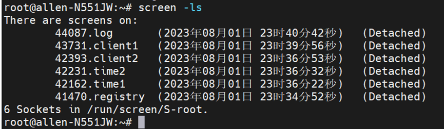
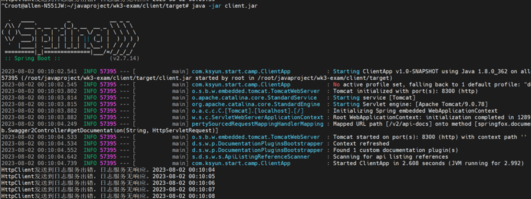
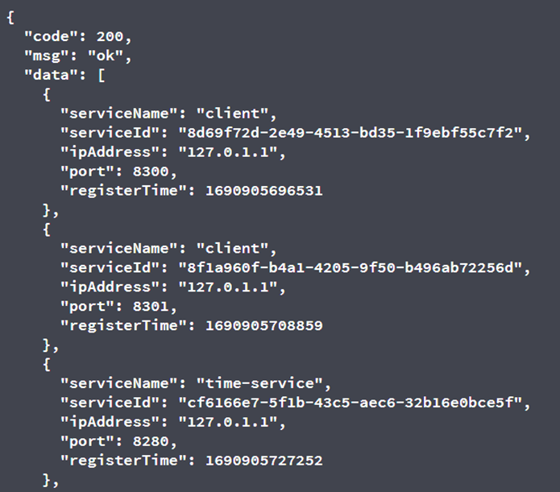
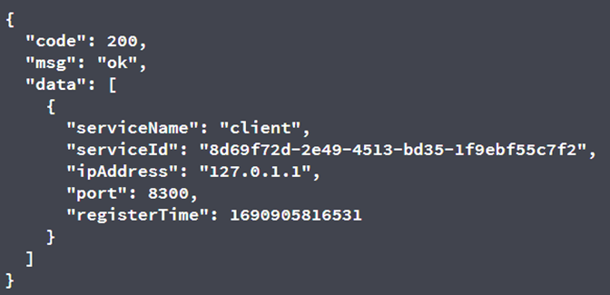
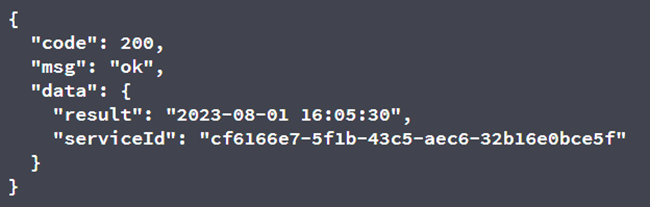
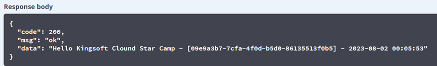
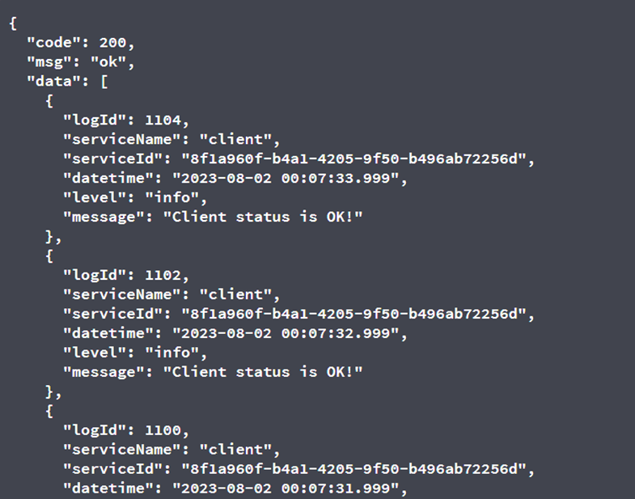
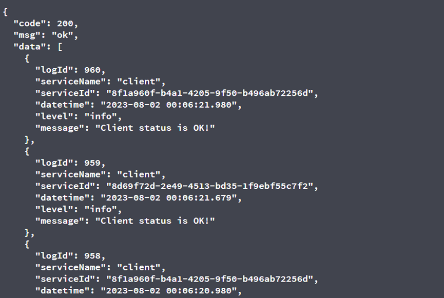

## **项目简介**

使用服务体系相关知识，使用 Java 语言，Spring Boot 框架实现一个基本的微服务架构，其由下列应用组件构成：

1.  发现与注册中心
2.  服务提供者（service, 2节点）
3.  服务调用客户端 (client, 2节点)
4.  分布式日志收集服务端
5.  Java 版本 8 (1.8)；
6.  使用纯 Spring Boot 框架实现，不使用任何 Spring Cloud 组件或现成微服务框架/解决方案；
    ## 实现功能点
> **1.实现一个简单服务注册中心 (register)。其服务端口为 8180，提供下述端点及功能：**

| 端点              | 功能说明    | 备注                                                            |
| :-------------- | :------ | :------------------------------------------------------------ |
| /api/register   | 服务注册    | 注册信息包含服务的名称、IP地址、端口号信息                                        |
| /api/unregister | 服务注销    | 存在多个同名服务其中一个注销的逻辑                                             |
| /api/heartbeat  | 客户端发送心跳 | 心跳超时60秒，无保护模式                                                 |
| /api/discovery  | 服务发现    | 此接口默认有一个可选参数，name。携带此参数请求时，通过指定的服务名称来“发现服务”，这种模式下包含服务端负载均衡逻辑。 |

&#x9;思路实现：内存中设置Map\<String, Set\<RegistryVo>> registerMap=new ConcurrentHashMap<>();所有存储数据在内存中。key为serviceName，value为RegistryVo的set。表示当前服务名的所有微服务。

&#x9;1.服务注册：此接口提供服务注册功能，请求访问此接口会把对应的信息保存在Map中。表示此服务已经注册，然后会开启定时任务，定时检查此服务是否超过60s还未进行心跳。超过60s进行剔除。并且会对请求参数进行检查，重复注册的会返回错误信息。

&#x9;2.服务注销：对应服务在进行正常下线会请求此接口。在map中找到这个服务信息并进行剔除。防止接收到攻击请求，会比对所有字段进行查询服务。而不是单一的根据服务id查。

&#x9;3.心跳服务：其他已经注册的服务会定时的请求此接口，此接口会查询对应的服务RegistryVo，并且设置属性注册时间为当前最新时间。

&#x9;4.服务发现：此接口返回Restful风格数据，不带参数返回所有服务，带参数返回对应服务名的一条服务。选择方式使用轮询选择。

> **2.实现一个简单时间服务 (time-service)，此服务在运行时有2个实例，其服务端口分别为 8280，8281，提供下述端点及功能：**

| 端点               | 功能说明            | 备注                             |
| :--------------- | :-------------- | :----------------------------- |
| /api/getDateTime | 获取当前日期时间信息及节点信息 | 此接口接受一个参数，style，决定返回何种样式的日期格式。 |

&#x9;思路实现：此服务在启动的时候向register服务进行注册，把当前服务的服务名，服务ID，IP，端口号保存在register服务的map中。然后开启定时服务，定期向注册中心的heartbeat接口发送数据。然后在@PreDestroy中写程序注册的时候的逻辑，当服务下线的时候访问注册中心的服务注销接口，删除对应的服务信息。

&#x9;1.获取时间接口：返回设置时间时区为GMT。接受full、date 、time、unix 四种入参。传入其他参数会返回失败。封装时间和服务ID到统一返回结果返回。

> **3.实现一个服务客户端 (client)，此服务在运行时有2个实例，其服务端口为 8300, 8301。它调用 2 所述的简单时间服务中的接口，然后进行相关处理，将处理结果通过 API 供其他应用使用**

| 端点           | 功能说明    | 备注                                                                                   |
| :----------- | :------ | :----------------------------------------------------------------------------------- |
| /api/getInfo | 获取客户端信息 | 此接口返回的内容，是调用简单时间服务接口后，获取其返回的完整时间信息 (full)，并拼返回的接服务 ID 后，按指定格式返回。如果简单时间服务不可用，将返回错误信息。 |

&#x20;   思路实现：此服务在启动的时候向register服务进行注册，把当前服务的服务名，服务ID，IP，端口号保存在register服务的map中。然后开启定时服务，定期向注册中心的heartbeat接口发送数据。此外，开启定时任务发送日志，每1秒向日志收集服务端写入一条日志，其包含客户端服务名称、客户端实例ID，时间（GMT、带毫秒）、消息级别、消息内容。然后在@PreDestroy中写程序注册的时候的逻辑，当服务下线的时候访问注册中心的服务注销接口，删除对应的服务信息。

&#x9;1.获取客服端信息：此接口先访问注册中心根据time-service进行服务发现，获得简单时间服务的ip+port，然后拼接/api/getDateTime去请求简单服务的获取时间接口，获得简单时间服务的ID和GMT时区的时间。把结果保存在统一返回结果。其中当前接口返回主要两个参数，第一个是服务ID，我使用的是简单时间服务的ID，第二个是时间，要转化为北京时间。

> **4.实现一个分布式日志收集服务端（ logging-service），其具备日志收集和日志简单查询功能。其服务端口为 8320，提供下述端点及功能：**

| 端点           | 功能说明     | 备注                                                                                  |
| :----------- | :------- | :---------------------------------------------------------------------------------- |
| /api/logging | 记录日志信息   | 接收客户端提交的日志记录请求，并将其保存于服务内部的存储中。提交的日志记录使用 JSON 格式，以 request body 方式传递。                |
| /api/list    | 获取日志信息列表 | 此 API 带有一个可选参数 service，其代表指定的服务ID。如果此参数存在，则列表中的数据按服务名过滤，此列表默认显示最后的5条记录（注意按照时间降序排序）。 |

&#x9;思路实现：此服务不用在注册中心注册。在内存中定义Map\<String,List\<LogVo>> map = new ConcurrentHashMap<>();key为服务ID，值为List类型的Log对象。再定义AtomicInteger logIdCounter = new AtomicInteger(1);每次新来的日志都设置日志ID，并且自增。其中判断日志是否重复，我的逻辑是除了日志ID，其他属性全部重写hashcode和eqals方法。

&#x9;1.获取日志信息接口：接受client服务的请求体。把请求日志放到map中，并且会先判断map的list中是否已经存在此日志。如果已经在了就不重复添加。

&#x9;2.获取日志信息列表：每次查询都按照日志ID进行排序。如果是带有serviceId会只取前五条。否则会取所有日志信息。

> **项目部署：项目在linux上成功打包并运行，返回结果为Restful风格，启动6个服务如下。**

&#x9;

&#x9;log服务未开启时，client服务报错信息

&#x9;

1.使用swagger测试registry服务发现所有。能正确返回如下结果。只截取前三条

&#x9;

&#x9;测试服务发现带服务名，负载均衡轮询发现。底层使用原子类。

&#x9;

2.测试时间服务接口。GMT时区

&#x9;

3.测试client接口调用时间服务。转化为了北京时区

&#x9;

4.测试日志查询接口带服务ID，取前五条数据去重降序排列

&#x9;

&#x20;测试日志服务查询所有日志。所有日志去重降序排列

&#x9;# Handwriting-Registration-Center
